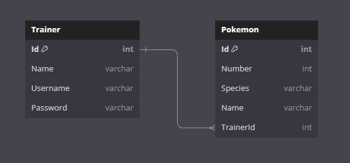

# PokéManager Frontend

A web app hosted on Azure where trainers can sign up, look through the different pokemon they want and make teams of them. Trainers can also search for other trainers, trainers' teams, and for pokemon details.

## Requirements
- Application must build and run
- Must have front-end build with React and talking to back end
- Front end should have styling applied 
- Utilize an external API
- Frontend Repo

## Tech Stack
- Vite
- React.js
- Typescript
- React Router
- Material UI
- PokeAPI

## MVP:
- User can register as a Trainer
- User can login as an existing Trainer
- User can view the list of all Pokemon
- User can search for Pokemon by name or Pokedex number
- User can view a page for a specific Pokemon
- User can add a Pokemon to their team with a nickname
- User can view their team of Pokemon
- User can rename a Pokemon in their team
- User can remove a Pokemon from their team
- Team size is limited to six Pokemon for each trainer

## Stretch Goals:
- List of Pokemon is paginated instead of using "Load More" button
- User can filter list of Pokemon by type
- User can change their Trainer name
- User can delete their Trainer account
- Frontend is Dockerized
- Trainers can have multiple teams

## ERD

## External API: 
- PokeAPI

## Project Management System:
- Trello

## How the project board is managed: 
- By: John Adams, Ludia Park

## Team 1 (The Best Team Ever):
- Rohit Rathor
- Jason Fox
- John Adams
- Ludia Park